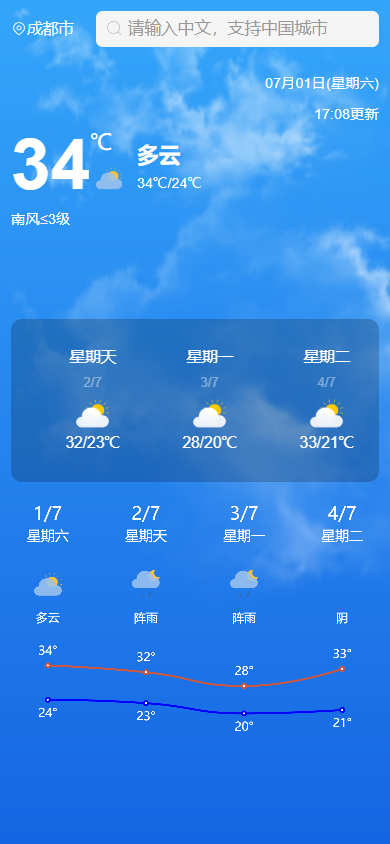

# weather-h5
<p align="center">
  
</p>


# Summary - 概要
  这个是一款根据中国城市搜索天气的web App，我们可以看到近4天的数据
  
  本项目基于React+TS+Echarts+axios+lodash+less+css Module来开发，基于axios做拦截器，可以统一处理错误请求。

## Development - 开发
  克隆此仓库，然后通过下面程序安装依赖项:
  
  目前的接口是基于本地node服务起的需要将这个项目启动起来[**weather-node-server**](https://github.com/ghyaaaa/weather-node-server)

  ```sh
  yarn install
  ```

  安装依赖后,可以通过一下操作来构建项目:

  启动项目:
  ```sh
  yarn dev
  ```
  打包项目:
  ```sh
  yarn build
  ```

